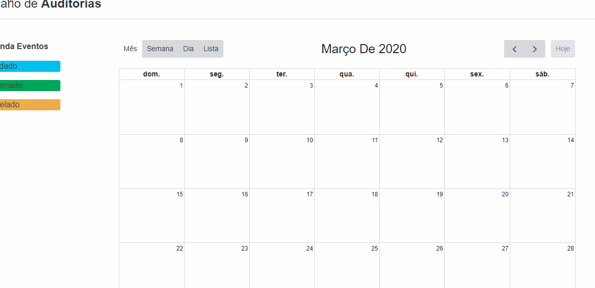

## Problema

Anualmente na empresa acontece diversas auditorias, sendo elas internas,ou externas. Caso seja externa ela pode ser de um organismo certificador ou cliente. Exemplos de organismo certificador: ISO-9001, FSC...
A auditoria precisa armazenar informações de data de início e fim, além de um campo de descrição breve, e deve possibilitar incluir vários auditores (Nome, Cpf, Cargo/função).
Importante que exista um controle de Status, dividido entre cancelado, agendado e confirmado.

## Requisitos
- Uma interface de consulta de auditorias cadastradas com seu status;
- Uma interface de cadastro de auditorias;
- Possibilidade de cadastrar, alterar e excluir auditorias;

## Requisitos para validação
- XAMPP (https://www.apachefriends.org/pt_br/download_success.html)
- No painel de Controle do XAMPP, inicie os serviços Apache e PHPMyAdmin
- Acesse a opção Admin do serviço PHPMyAdmin -> Novo -> Importar -> Arquivos da aplicação (https://github.com/nicoleCopetti/development-challenge/blob/master/base-dados.sql)
- Inclua os arquivos do sistema no local de instalação do xampp-> htdocs (https://github.com/nicoleCopetti/development-challenge.git)
- No navegador acesse (http://localhost/auditorias/public/)

## Utilização do Sistema

